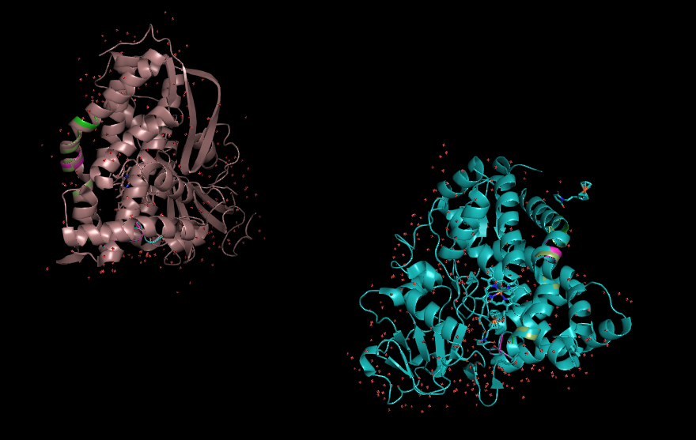

# Identification de motifs structuraux dans les protéines  
  
Projet en Bioinformatique sur l'identification des motifs structuraux des protéines à l'aide du logiciel PyMOL pour la visualisation (https://pymol.org/)  
  
Pour mieux comprendre le projet et les algorithmes mis en place : voir le rapport et les ressources à disposition.

## Références  
  
```
@phdthesis{carpentier_methodes_2005,
	type = {These de doctorat},
	title = {Méthodes de détection des similarités structurales : caractérisation des motifs conservés dans les familles de structures pour l' annotation des génomes},
	copyright = {Licence Etalab},
	shorttitle = {Méthodes de détection des similarités structurales},
	url = {https://www.theses.fr/2005PA066571},
	school = {Paris 6},
	author = {Carpentier, Mathilde},
	collaborator = {Netter, Pierre},
	month = jan,
	year = {2005},
	keywords = {Alignement structural multiple, Motifs structuraux communs, recherche, Protéines, familles structurales, Protéines, structure, Structures protéiques, classification},
	annote = {Sous la direction de Pierre Netter. Soutenue en 2005, à Paris 6.},
}
```  
  
## Instructions  
  
Entrez sur le terminal et suivez les instructions indiquées :  
  
```
python main.py
```  
  
## Visualisation avec PyMOL (exemple)  

Les motifs structuraux similaires sont représentés par les classes de couleurs (vert et rose dans l'exemple).  
    

